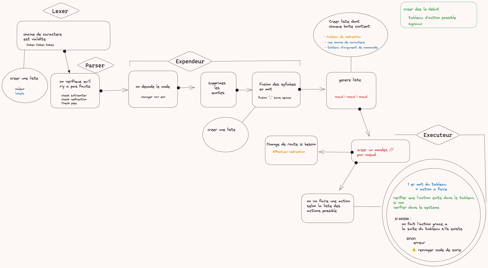

<h1 align="center">Minishell</h1>
<p align="center">
	
</p>

- [Description](#description)
- [Structure du projet](#structure-du-projet)
	- [GitFlow](#gitflow)
	- [Hiérarchie des fichiers](#hiérarchie-des-fichiers)
- [Logique de traitement](#logique-de-traitement)
- [Utilisation de minishell](#utilisation-de-minishell)
	- [Pré-requis](#pré-requis)
	- [Compilation du projet](#compilation-du-projet)
	- [Exécution du projet](#exécution-du-projet)
- [Fonctionnalités demandées dans les consignes du projet](#fonctionnalités-demandées-dans-les-consignes-du-projet)
	- [Prompt interactif](#prompt-interactif)
	- [Historique des commandes](#historique-des-commandes)
	- [Recherche et exécution des commandes](#recherche-et-exécution-des-commandes)
	- [Gestion des quotes](#gestion-des-quotes)
	- [Redirections](#redirections)
	- [Pipes](#pipes)
	- [Variables d'environnement](#variables-denvironnement)
	- [Signaux](#signaux)
	- [Builtins](#builtins)

## Description

Premier projet de groupe réalisé avec [Nociception](https://github.com/Nociception).  

L’objectif de ce projet est de créer un shell minimaliste en langage C, similaire à bash. Ce projet permet d'explorer les concepts fondamentaux de la gestion des processus, des descripteurs de fichiers, et des interactions avec le système d'exploitation.

Le lien vers le Notion utilisé pour l'analyse, la documentation, la gestion de projet, et une partie de la gestion des tests. Nous avons détaillé les sujets et les éléments demandés, construit un schéma sur notre vision du projet et sa mise en place au niveau du code.
- [Notion minishell](https://ameldev.notion.site/minishell-14cd62d0faa34c38a0fd44de32bcf35c?pvs=4)

## Structure du projet

### GitFlow

### Hiérarchie des fichiers
```tree
├── builtins
│   ├── cd
│   ├── exit
│   ├── export
│   ├── unset
├── exec
│   ├── build_exec_list
│   ├── execution
│   ├── here_doc
│   └── solo_builtin
├── expander
├── include
│   ├── libft
│   │   ├── Makefile
│   │   └── README.md
├── lexer
├── parser
└── utils
    ├── before_prompt_loop
    ├── environment_management
    ├── error_msg
    ├── free
    └── generic
```

- **exec** : Gestion de l'exécution des commandes.
- **expander** : Structure les données d'entrée pour qu'elles puissent être utilisées.
- **include** : Contient les fichiers d'en-tête nécessaires au projet.
- **lexer** : Premier traitement et sauvegarde des données si valides.
- **parser** : Vérifie la validité de la chaîne de caractères passée en entrée (exemple : pas de `.`).
- **builtins** : Implémentation des commandes intégrées (builtins).

## Logique de traitement

<div align="center">
	
</div>

**lexer**
Premier traitement des données d'entrée (exemple : quotes non fermées génèrent une erreur `"msg"`). Si les premiers tests sont validés, les données sont enregistrées dans une liste chaînée et un type de l'énumération `e_lexer_type` leur est donné (exemple : `| => PIPE`).

**parser**
Vérifie la validité de la chaîne de caractères passée en entrée (exemple : `<<<` génère une erreur).

- **expander** :
Nettoyage des données, transformation des variables d'environnement, suppression des quotes, etc. Génère une nouvelle liste chaînée utilisée pour l'exécution du programme.

- **exec** :
Traite les nœuds de la liste chaînée, transforme les routes si nécessaire (pour les redirections), exécute les actions si elles existent ou renvoie un message d'erreur.

Gestion de l'exécution des commandes.

## Utilisation de minishell

### Pré-requis

- **Compilateur `gcc`** : Assurez-vous d'avoir `gcc` installé sur votre machine.
- **Bibliothèque `readline`** : Utilisée pour la gestion de l'historique et l'édition de ligne.

⚠️ Possible problème de compilation sous Mac, préférez Linux.

### Compilation du projet
```shell
make
```

### Exécution du projet

```shell
./minishell
```
Entrez une commande comme dans un shell bash selon les fonctionnalités disponibles citées ci-dessous.

## Fonctionnalités demandées dans les consignes du projet

### Prompt interactif

Le shell affiche un prompt en attente de nouvelles commandes. Il est interactif et permet à l'utilisateur d'entrer des commandes à exécuter.

### Historique des commandes

Le shell conserve un historique des commandes entrées par l'utilisateur. Cela permet de naviguer facilement entre les commandes précédentes.

### Recherche et exécution des commandes

Le shell cherche et lance les exécutables basés sur la variable d'environnement `PATH`, ou via un chemin relatif ou absolu. Il ne doit pas utiliser plus d’une variable globale, et cette utilisation doit être justifiée.

### Gestion des quotes

- **Quotes simples (`'`)**: Empêchent l'interprétation des méta-caractères dans la séquence entre quotes.
- **Quotes doubles (`"`)** : Empêchent l'interprétation des méta-caractères sauf le `$`.

### Redirections

- `<` : Redirige l'entrée.
- `>` : Redirige la sortie.
- `<<` : Lit l'entrée jusqu'à un délimiteur spécifié. L'historique n'est pas mis à jour dans ce cas.
- `>>` : Redirige la sortie en mode append.

### Pipes

Le shell gère les pipes (`|`), permettant de connecter la sortie d'une commande à l'entrée de la suivante.

### Variables d'environnement

Le shell gère les variables d'environnement et substitue `$?` par le statut de sortie de la dernière commande exécutée. Les variables d'environnement sous la forme `$NOM` sont substituées par leur contenu.

### Signaux

- **ctrl-C** : Affiche un nouveau prompt sur une nouvelle ligne.
- **ctrl-D** : Quitte le shell.
- **ctrl-\** : Ne fait rien.

### Builtins

- **echo** : Affiche une chaîne de caractères, avec l'option `-n` pour ne pas ajouter de retour à la ligne.
- **cd** : Change le répertoire courant, uniquement avec un chemin relatif ou absolu.
- **pwd** : Affiche le répertoire courant, sans aucune option.
- **export** : Exporte une variable d'environnement, sans aucune option.
- **unset** : Supprime une variable d'environnement, sans aucune option.
- **env** : Affiche les variables d'environnement, sans aucune option ni argument.
- **exit** : Quitte le shell, sans aucune option.
